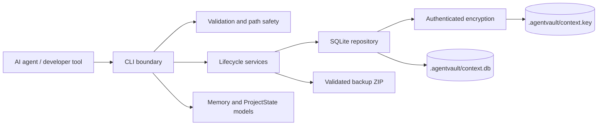
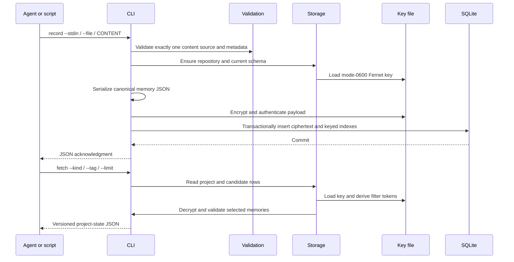
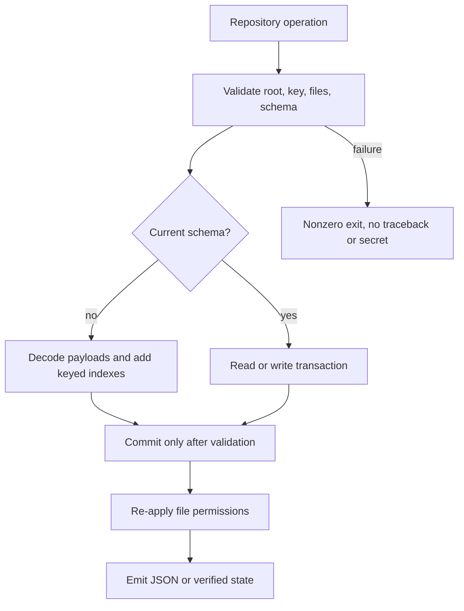

# Agent-Vault Architecture

## Overview

Agent-Vault is a **local-first modular monolith**. It has no daemon, hosted service, account, or network dependency. The command-line boundary is deliberately small so an AI agent, editor plugin, or local script can invoke it and parse stable JSON. The implementation separates validation, domain models, cryptography, SQLite persistence, and lifecycle operations so each boundary can be tested independently.

The core invariant is that memory content is never persisted as plaintext. A complete `Memory` object is serialized to canonical JSON and encrypted with Fernet before insertion into SQLite. The database stores only project metadata, memory IDs, timestamps, encrypted payloads, and keyed HMAC tokens used for equality filtering.

## Component Diagram



## Command Data Flow



## Repository Layout

```text
.agentvault/
├── context.db       # SQLite database; mode 0600
├── context.db-wal   # SQLite WAL while active; mode controlled by SQLite
├── context.db-shm   # SQLite shared-memory file while active
└── context.key      # Fernet key; mode 0600
```

The `.agentvault` directory is mode `0700`. `.agentvault/`, database files, key files, WAL/SHM files, temporary repositories, archives, build outputs, and tool caches are excluded by `.gitignore`.

## Data Model and Privacy Contract

The database contains a singleton project row, encrypted memory rows, metadata, and keyed filter indexes:

| Table | Purpose | Plaintext fields |
| --- | --- | --- |
| `metadata` | Stores the internal schema version. | Version string only. |
| `project` | Identifies the local project context. | UUID, validated name, normalized root path, timestamp. |
| `memories` | Stores one row per memory. | Random ID, timestamp, HMAC kind token, encrypted payload. |
| `memory_tags` | Supports equality filtering by tag without plaintext tags. | Memory ID and HMAC tag token. |

The payload contains the full interoperable `Memory` object: content, kind, tags, source, sensitivity, ID, and creation timestamp. Fernet provides authenticated encryption; a tampered payload fails verification before deserialization. JSON is parsed with the standard library only, and all decoded values are passed through explicit validation.

The keyed tokens make `--kind` and `--tag` filtering indexable without exposing those values in the database. They are deterministic only within the same repository key and are not a replacement for encryption. The implementation still decrypts and validates returned rows before emitting JSON.

## Transactions, Migrations, and Recovery

Initialization creates a private temporary repository under the project root, creates the key and SQLite schema, hardens file permissions, and atomically renames the temporary directory into `.agentvault`. Failures remove the temporary directory and return a safe `RepositoryError`; an existing repository is never overwritten.

SQLite connections use a five-second timeout, a five-second busy timeout, WAL mode, foreign keys, and context-manager cleanup. Writes use explicit `BEGIN IMMEDIATE` transactions. Schema upgrades decode all existing encrypted memories before creating or populating keyed indexes. The upgrade commits only after every row is valid, so failed migrations do not publish partial index state.

Backups run a SQLite online snapshot, include the database and key, write a fixed manifest, enforce archive member names and size limits, and atomically replace the destination archive. Restore stages and validates the archive before moving it into place; replacement uses a previous-directory rollback path. Key rotation decrypts and re-encrypts every row inside a transaction and restores original payloads if replacing the key fails.



The supported internal schema versions are `1.0` and `1.1`. The current schema is `1.1`. The public JSON envelope is versioned separately as documented in [`docs/memory-schema.md`](docs/memory-schema.md).

## Lifecycle Boundaries

`status` reports non-sensitive repository facts without decrypting memories. `verify` validates the key, database integrity, schema, project metadata, timestamps, symlink safety, and every encrypted payload. `migrate` upgrades supported older schemas. `backup` and `restore` use a constrained archive format and never extract arbitrary paths. `rotate-key` re-encrypts all payloads under a new key while preserving the original key and payloads on failure.

All operational failures are converted to safe domain errors. The CLI returns `1` for operational failures and `2` for malformed usage. No normal output includes keys, decrypted payloads on error, ciphertext, or unnecessary secret material.

## Security Boundaries and Threat Model

Agent-Vault protects memory data against accidental plaintext persistence, ordinary repository inspection, Git commits, malformed archives, path traversal, symlink substitution, corrupted ciphertext, and overly permissive key files. It does not protect against a local attacker with equivalent privileges, a compromised Python interpreter, process-memory inspection, a malicious plugin running as the same user, or loss of the encryption key.

The design is intentionally single-user and local. It provides no remote synchronization, conflict resolution, multi-user access-control list, cloud key escrow, or cross-machine replication. Integrations must define their own trust boundary and may exchange only the versioned JSON state produced by `fetch`.

The security review therefore treats **key possession as repository possession**. Backups contain the key because a database without it cannot be recovered; backup archives must be stored as secrets. Sensitive command input should use `--stdin` or `--file` to avoid shell history and process-argument exposure.
